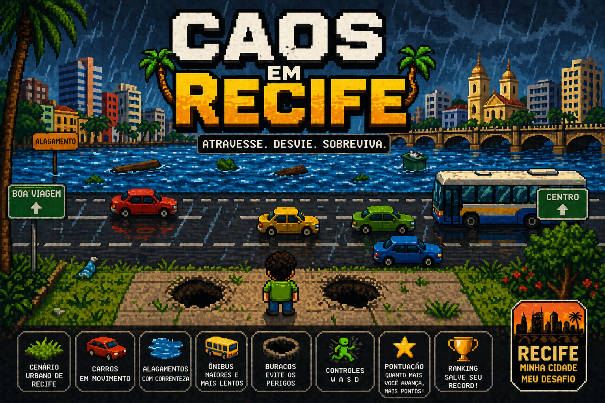

# Caos em Recife



Jogo simples em C usando Raylib. O objetivo e atravessar a rua desviando dos carros.

## Estrutura do projeto

```text
Caos-em-Recife/
├── assets/
│   └── capa-crossy-recife.png
├── include/
│   ├── config.h
│   ├── jogador.h
│   ├── jogo.h
│   ├── mapa.h
│   └── obstaculo.h
├── src/
│   ├── jogador.c
│   ├── jogo.c
│   ├── main.c
│   ├── mapa.c
│   └── obstaculo.c
└── README.md
```

## Controles

| Tecla | Acao |
| --- | --- |
| W | Subir |
| A | Esquerda |
| S | Descer |
| D | Direita |
| R | Reiniciar depois do game over |

## Como compilar

```powershell
$env:Path = "C:\raylib\w64devkit\bin;" + $env:Path; gcc src\main.c src\jogo.c src\jogador.c src\obstaculo.c src\mapa.c -o CrossyRecife.exe -Iinclude -IC:\raylib\w64devkit\include -LC:\raylib\w64devkit\lib -lraylib -lopengl32 -lgdi32 -lwinmm
```

## Como executar

```powershell
.\CrossyRecife.exe
```
