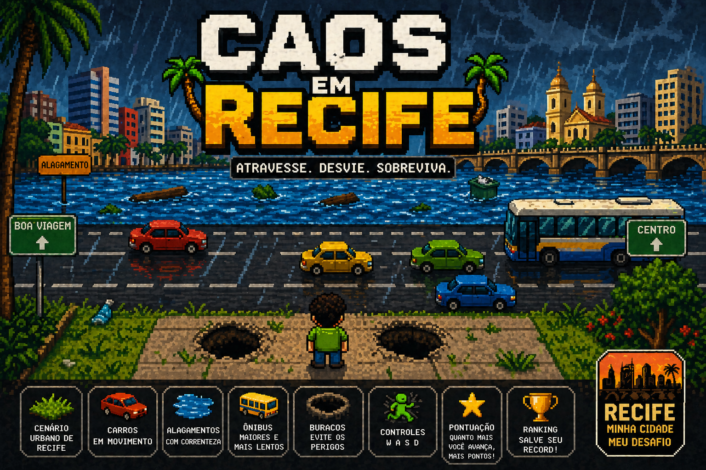

# Caos em Recife



Jogo simples em C usando Raylib. O objetivo e atravessar a rua desviando dos carros e chegar ate a parte de cima do mapa.

O projeto esta separado em arquivos de jogador, obstaculo, mapa, menu, score e jogo para facilitar a manutencao.

## Video de apresentacao

Assista ao video apresentando o jogo: https://youtu.be/Ydrz2RGMz_o

## Conteudos de programacao usados

- Alocacao dinamica: os obstaculos sao criados com `malloc` em `src/obstaculo.c`, na funcao `CriarObstaculo`, ligados em uma lista encadeada por `AdicionarObstaculo` e liberados com `free` em `LiberarObstaculos`.
- Matrizes: animacoes e tamanhos usam matrizes, como `cachorro[2][4]` e `tamanho[4][2]` em `src/obstaculo.c`.
- Vetores/tabelas: o mapa e os obstaculos tambem usam vetores para guardar linhas, texturas e configuracoes do jogo.

## Estrutura do projeto

```text
Caos-em-Recife/
|-- assets/
|   |-- cachorro/
|   |-- cenario/
|   |-- itens/
|   |-- personagem/
|   `-- veiculos/
|       |-- carros/
|       |-- motos/
|       `-- onibus/
|-- include/
|   |-- config.h
|   |-- debug_mode.h
|   |-- jogador.h
|   |-- jogo.h
|   |-- mapa.h
|   |-- menu.h
|   |-- obstaculo.h
|   `-- score.h
|-- src/
|   |-- debug_mode.c
|   |-- jogador.c
|   |-- jogo.c
|   |-- main.c
|   |-- mapa.c
|   |-- menu.c
|   |-- obstaculo.c
|   `-- score.c
|-- Makefile
|-- README.md
`-- scores.txt
```

## Controles

| Tecla | Acao |
| --- | --- |
| W | Subir |
| A | Esquerda |
| S | Descer |
| D | Direita |
| R | Reiniciar depois do game over |

## Como compilar

Usando o comando completo:

```powershell
$env:Path = "C:\raylib\w64devkit\bin;" + $env:Path; gcc src\main.c src\menu.c src\debug_mode.c src\jogo.c src\jogador.c src\obstaculo.c src\mapa.c src\score.c -o CrossyRecife.exe -Iinclude -IC:\raylib\w64devkit\include -LC:\raylib\w64devkit\lib -lraylib -lopengl32 -lgdi32 -lwinmm
```

Ou usando o Makefile:

```powershell
mingw32-make
```

## Como executar

```powershell
.\CrossyRecife.exe
```
